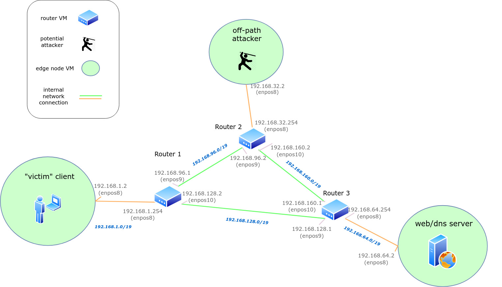

# virt-lab
VM lab environment for doing network stuff

### Requirements

* Virtualbox (5.2 or older)
* Vagrant 2.2.x

### Setup base virtual network

1. Start all 6 VMs (3 routers and 3 edge nodes): `./boot_all.sh`
2. Go do something else cause its gonna take a while..
3. ssh to some machine: 
  * ssh by port: `ssh -l vagrant localhost -p 22111`  
  * ssh with vagrant: `cd edgers/vpn-server/ && vagrant ssh` or `cd <path-to-vagrantfile> && vagrant ssh`
4. Restart all the machines to make network changes take effect: `./stop_all.sh` then `./start_all.sh`
5. Make sure edge nodes can ping eachother: `ping 192.168.3.2`

#### Build VPN server

1. Copy setup scripts to vpn server VM: `cd virt-lab/edgers/vpn-server && ./copy_vpn_setup.sh`
2. Ssh to vpn server VM: `cd virt-lab/edgers/vpn-server && vagrant ssh`
3. Run interactive script to setup vm as a OpenVPN server: `./setup_vpn.sh`
* Keep hitting `Enter` or `y` to leave all default values
4. Run script to make base config and generate client1 config file: `./make_client_configs.sh`
5. Run script to generate client2 ovpn config file: `./sec_config.sh`

#### Connect client to VPN server

1. Run script to copy `client1` config file from vpn server to client vm: `cd virt-lab/edgers/client && ./copy_client_config.sh`
2. Ssh to the client VM: `cd virt-lab/edgers/client && vagrant ssh`
3. Install OpenVPN on the client vm: `sudo apt install openvpn -y`
4. Connect to the local vpn server: `sudo openvpn --client --config client1.ovpn &`

#### Setup DNS server on "web-server" node

1. Run script to copy dns setup scripts to vm: `cd virt-lab/edgers/web-server && ./copy_dns_setup.sh`
2. Ssh to server vm: `cd virt-lab/edgers/web-server && vagrant ssh`
3. Run docker install script: `./install_docker.sh`
4. Start the dns bind docker container: `./start_dns.sh`
5. Check to make sure its alivee: `docker ps` or `docker logs bind`

#### Setup attack router for dns inject stuff

1. Start script to copy attacker setup to vm: `cd virt-lab/routers/router1 && ./copy_attacker_setup.sh`
2. Ssh to router vm: `cd virt-lab/routers/router1 && vagrant ssh`
3. Run the setup script to install spoofing libraries and repo: `./setup_attacker.sh`
4. Change to dns attack folder: `cd VeepExploit/other-end/dnuss/full_scan`
5. Compile the attack script: `make`
6. Run the attack: `sudo ./uud_send <dns_server_ip> <src_port (53)> <vpn_server_ip> <start_port> <end_port>`

### Teardown

1. Stop all the VMs: `./stop_all.sh`
2. Destroii all VMs in our path: `./destroy_all.sh`

